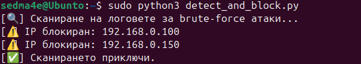
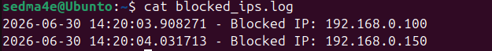

# SSH Brute Force Detection Tool

A Python-based security tool that detects SSH brute-force attacks by analyzing Linux authentication logs and automatically blocks malicious IP addresses using UFW.

## Project Overview

This project was developed to demonstrate automated detection and mitigation of SSH brute-force attacks on Linux systems.

The application scans authentication logs, identifies repeated failed login attempts and automatically blocks malicious IP addresses using the UFW firewall.


## Features

- Detects failed SSH login attempts from `/var/log/auth.log`
- Extracts source IP addresses using Regular Expressions (Regex)
- Counts failed login attempts for each IP address
- Automatically blocks IP addresses after a configurable threshold
- Prevents duplicate firewall rules by checking previously blocked IPs
- Logs blocked IP addresses with timestamps


## Technologies

- Python 3
- Ubuntu Linux
- UFW Firewall
- Regular Expressions (Regex)

### Development Environment

- Oracle VirtualBox


## Skills Demonstrated

- Python scripting
- Linux system administration
- Log analysis
- Regular Expressions (Regex)
- Firewall automation
- Basic cybersecurity concepts


## How it Works

```text
SSH Login Attempt
        │
        ▼
/var/log/auth.log
        │
        ▼
Python Detection Script
        │
        ├── Parse log entries
        ├── Count failed attempts
        ├── Check threshold
        ├── Check if IP is already blocked
        │
        ▼
UFW Firewall
        │
        ▼
blocked_ips.log
```


## Installation

Clone the repository:

```bash
git clone https://github.com/petzmitev/ssh-bruteforce-detector.git
```

Go to the project directory:

```bash
cd ssh-bruteforce-detector
```

---

## Usage

Run the script:

```bash
sudo python3 detect_and_block.py
```


## Demo

### Script Execution

The example below demonstrates the script scanning Linux authentication logs and automatically blocking IP addresses that exceeded the configured threshold.



### Blocked IP Log

Blocked IP addresses are recorded with timestamps in `blocked_ips.log` for auditing purposes.




## Future Improvements

- Real-time log monitoring
- Email notifications
- Automatic IP unblocking after a configurable time
- Configurable threshold through a configuration file
- Docker support


## Author

Peter Mitev
